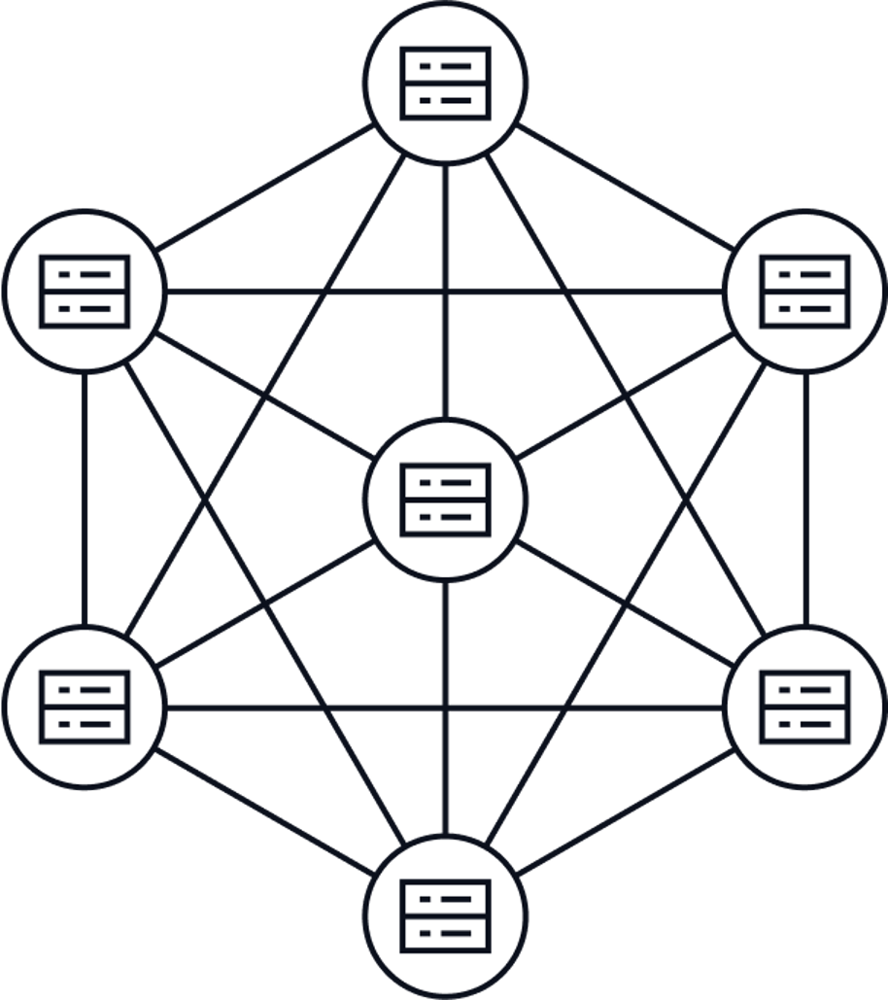

# 区块链基础知识

[返回目录](../README.md) 

## 什么是区块链？

我们从建立"区块链"的概念开始，Web3 的重要活动都发生在区块链上，那么什么是区块链呢？

  
  
<i>区块链拥有数个节点</i>

这幅图可以帮助我们直观理解，我们来看看图上有哪些元素？
- 有很多个圈，每一个代表一台独立的服务器
- 有很多条线，这说明每一台独立的服务器之间都有一条线，说明他们能通讯，即传递信息

## 区块链如何工作？

是什么信息需要他们传递呢？比特币是区块链最早的应用，用户最常见的操作就是转账，比如我的钱包里有1个BTC，当我把它通过区块链转给你，我的钱包就少了1个BTC，而你的钱包就多了一个BTC。

在这个过程中，我们可以思考几个问题？
- 在转账之前，这个 BTC 存储在哪？
- 转账是如何发生的？

### 类比 Web2 的概念

我们可以类比传统互联网的银行，假如我们获得了这比转账的账单（转账记录），我们是否能回答这个问题？是可以的，因为：
- 账单上会显示，转帐前钱存在我的银行卡号对应的银行账户下
- 也会记录，从哪转到了哪，也就是哪里会减少钱，哪里会增加钱

现在我们知道，独立服务器间传递的就是账单！

## 区块链的核心特性

区块链是什么，一句话概括——分布式账本，分布式代表，每一个节点之间可以相互通讯，并且保存相同的信息，账本说明这些信息就是发生在链上的转账记录，让我们假设 Alice 转给 Bob 10 美元：
- 首先，假如是左下角那个服务器记录了 "Alice 转给 Bob 10 美元"，因为每台服务器上运行着相同的完成区块链功能的软件，软件让它把这个信息告诉别的服务器
- 接着，左下角的服务器可能选择优先告诉中间的服务器
- 最后，整个网络都知道了这件事，并确定了这笔交易

## 区块链的安全性

现在，如果左下角服务器的拥有者，试图篡改这个确定的交易为 "Alice 转给 Bob 20 美元"，但区块链会发现这和其他服务器上的内容不一致，这会导致左下角的服务器被踢出区块链，这样"Alice 转给 Bob 10 美元"的事实就无法改变了，这就是区块链保证安全的主要方式，牺牲了重复的存储空间，即所有节点保存了完全相同的数据。

**_现在你是否对区块链有一个简单的认识了？_**

---

[返回目录](../README.md)
