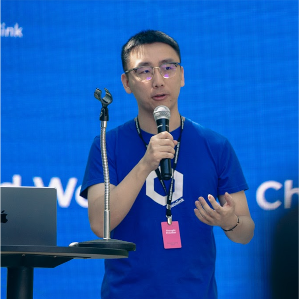

# 17小时最全Web3教程：ERC20，NFT，Hardhat，CCIP跨链

## 讲师信息
### Frank Kong

Chainlink Labs 开发者关系工程师  
十年行业经验

[Github 个人介绍页](https://github.com/qingyangkong)
[B站 Web3领域粉丝量 No.1](https://b23.tv/rHwcZRb)

## 课程形式
**免费录播**

[课程链接：B站视频](https://www.bilibili.com/video/BV1RFsfe5Ek5)

## 课程目录
1. 区块链基础知识
2. Solidity基础：Hello World
3. Solidity进阶：FundMe & ERC-20
4. Hardhat 开发框架：完成 FundMe
5. Hardhat 开发框架：合约测试
6. 跨链应用
7. 接下来做什么
