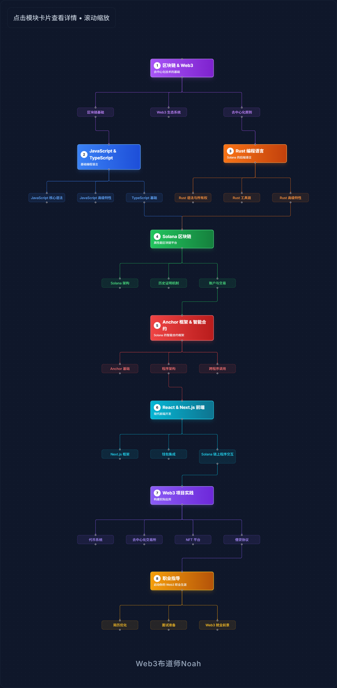

# Solana 训练营，三个月高强度项目实战，带你开启 Web3 职业大门

> 在第一天的课程上，OpenBuild 社区负责人推荐了 Rust 开发，而 Solana 区块链正是完全由 Rust 构建的，实际上，由于美国总统特朗普 1 月上任时在 Solana 上发了 Trump 币（[Trump Memes](http://gettrumpmemes.com/#address)），将 Sol 链的活跃度拉到了高峰，也超过了多年的老二 Ethereum（以太坊，老大是数字黄金比特币）。

在 Solana 的官网上，始终保持 300 多个岗位的招聘需求，不要觉得少，新的岗位在增加，招到人的会撤掉。而据统计的活跃 Web3 核心开发者仅 1 万人，如果没有多年的开发经验，凭借自学需要相当强的能力，才能与他们分一杯羹，这就是为什么好像学的人很多，但找到工作的人却没几个。

Web3 一样卷，只不过卷的层面和 Web2 不同，Web3 需要项目有影响力，而非团队有多庞大，这意味着高薪的工作同时需要具备过硬的实力，比如 GMGN 这样不过 30 多人的团队，仅通过提供 SOL 的链上数据分析工具，巅峰期年盈利 6000 万美金，团队的每个人都是千万富翁。

虽然 Solana 区块链是行业老三，但学习资料仍然少的可怜，除了官方文档和根本就是不是面向新手的训练营（可以去试试0基础能否听懂），这是两方面原因造成的：

1. 区块链发展速度本来就很快，每一年的热点和活动主题都在变，去年是 TON 链戏， RWA 资产通证化，今年就是 Solana Meme 币，AI Agent，这对职场人是好事也是坏事，好事是总是给有新的机会，坏事是要学的东西太多，而且门槛越来越高（要知道 Rust 可是被很多人认为比 C++ 都难的编程语言）；

2. 如果遍地是 Solana 开发者，就业压力反而会更大，我举一个经典的例子 —— Java，Java 的培训市场已经到了什么地步呢，头部培训机构，一周就能做一个完整的 Java 教程出来，而新手看完甚至都不止一周，培训机构仍然在鼓吹 Java 高薪易学，实际上选择 Java 毕业即失业的人不在少数，Java 傲视群雄的 Spring 生态，让企业应用开发便捷迅速的初衷，在培训市场的畸形发展下，已经成了职场人的就业陷阱。

所以，Solana 训练营就是基于这样的困境展开的，提供从 Solana DApp 全栈开发技术，从 JavaScript、TypeScript、Rust 的语言基础，到区块链后端 Anchor 合约开发框架，再到前端 React & Next.js 前端框架，外加精心挑选的四个完整的项目实战（比如去中心化交易所 DEX 这种绝对的加分项），外加就业指导和交易所内推资源，如果这都不行，那其他人也做不到。

## 讲师信息
### Noah Lu

Gate.io 交易所区块链研究员  
十年全栈开发经验，从设计到产品，从开发到营销能力恐怖的行业专家

[Github 个人介绍页](https://github.com/qingyangkong)  
[B站 Web3领域粉丝量 No.2](https://b23.tv/mDs63XZ)  

*一年超 5000 次提交的实战大师*

## 课程形式（付费+就业指导）
> ### **⚡ 5 月二期即将开班，限时社区推荐 9 折优惠 ⚡**
> ### **📢 注：为保证服务质量，每期仅招 30 人 📢**

今年 Web3 培训诈骗事件频发，也导致认真做事的人受到怀疑，每一节课都由 Noah 直播带写授课，在线学习平台由 Noah 主导开发，从代码到项目 100% 原创，只有别人抄我们，没有我们偷别人，这就是自信！Solana 训练营联合多家 Web3 平台进行推广，它们既是见证者，也是监督者。

- 录播+直播答疑
- 自研在线学习平台（直播回放+课件）
- 项目带做 + 简历修改
- Gate.io, Bybit 两家交易所内推资源
- 一次付费，终身学习，后续更新会直接添加到在线学习平台的个人账户中
- 报名三天内随时退款，服务正规可靠

## 报名方式
### 1. 访问官网并登录
**访问[soldevcamp.com](https://www.soldevcamp.com/)，点击右上角"登录"按钮，支持 Gmail、Google 账号、Phantom Solana 钱包多种登录方式**

### 2. 使用邀请链接或邀请码
> **⚠️ （重要）登录成功后必须通过[邀请链接](https://soldevcamp.com?ref=NA3MLFTH)访问，或在报名时手动填写邀请码 `NA3MLFTH`，否则折扣码无效！**

邀请链接：**https://soldevcamp.com?ref=NA3MLFTH**

### 3. 点击"立即报名"并确认邀请码
**点击最上方导航栏的"课程费用"，再点击"立即报名"，检查邀请码是否为 `NA3MLFTH`，状态显示"已验证"**

### 4. 输入专属折扣码
**点击"我有折扣码"，输入社区专属的 9 折优惠码：`LINKLINK`，点击应用按钮**

### 5. 填写联系方式并完成支付
**输入您的联系方式（手机号 + 邮箱），点击下一步，支持多种支付方式：**
- Solana、Polygon、BSC、Arbitrum 等区块链支付
- 微信和支付宝转账

### 导师微信

> **如有问题请联系：**
> - **支付困难、优惠码问题**：微信 `hzh_chainlink`（无好友验证，可直接添加）
> - **课程技术咨询**：微信 `Web3Noah`（需验证，添加时请备注：**Alex推荐**）
